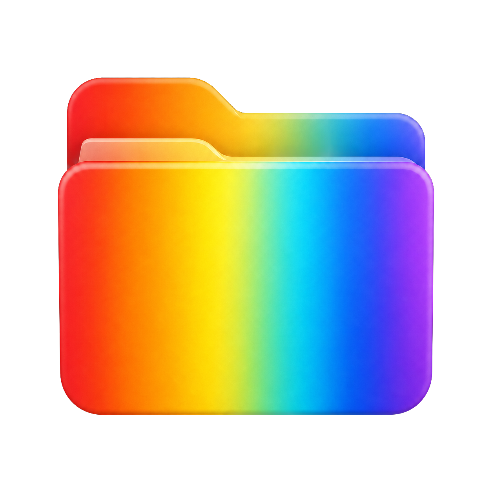

# Folder Colorizer

<p align="center">
  
</p>


A small, native Windows app that gives folders distinctive colors in File
Explorer. Choose one of 12 colors from the app or directly from the folder
context menu.

## Why it stays reliable

Folder Colorizer creates a hidden multi-resolution icon inside the selected
folder and points the folder's `desktop.ini` to that relative file. This means:

- the color appears anywhere Explorer displays the folder icon, including
  pinned Quick Access/Home entries;
- the icon travels with the folder when it is moved;
- colors remain after Folder Colorizer is uninstalled;
- existing `desktop.ini` settings are backed up and restored when you choose
  **Restore default**.

No Explorer extension DLL is injected into the shell process.

## Install

Download `FolderColorizer-1.0.1-Setup.exe` from
[Releases](https://github.com/dszharikov/FolderColorizer/releases) and run it.
The installer is per-user and does not require administrator rights.

On Windows 11, Microsoft places classic registered commands under
**Show more options**. Open it and choose **Folder Colorizer**, then a color.
Windows 10 shows the submenu directly.

> Uninstalling the app intentionally does not remove colors already applied to
> folders: each folder owns its icon. Restore folders before uninstalling if
> you do not want their colors to remain.

## Build

Requirements:

- Windows 10 or 11;
- [.NET 10 SDK](https://dotnet.microsoft.com/download/dotnet/10.0);
- [Inno Setup 6](https://jrsoftware.org/isdl.php) to build the installer.

```powershell
dotnet test .\FolderColorizer.slnx --configuration Release
.\build-installer.ps1
```

The self-contained application is written to `artifacts\publish`; the installer
is written to `artifacts\installer`. End users do not need to install .NET.
Every pushed `v*` tag also creates a GitHub release and attaches the installer
automatically.

```powershell
git tag v1.0.1
git push origin v1.0.1
```

To try the context menu from a development build:

```powershell
dotnet run --project .\src\FolderColorizer -- --register
# Remove it later:
dotnet run --project .\src\FolderColorizer -- --unregister
```

## How it works

The app uses the documented Windows `desktop.ini` folder customization
mechanism. It:

1. generates a polished ICO containing ten resolutions from 16 to 256 pixels;
2. stores it as hidden `.foldercolorizer.ico` in the selected folder;
3. updates only the icon values in `desktop.ini`, preserving unrelated data;
4. marks the folder as read-only so Explorer processes its customization;
5. notifies Windows Shell that the item changed.

The context menu is registered only for the current user under `HKCU`; no
administrator access or in-process shell extension is needed.

## Privacy

Folder Colorizer is local-only. It has no analytics, network requests, accounts
or background services.

## License

[MIT](LICENSE)
